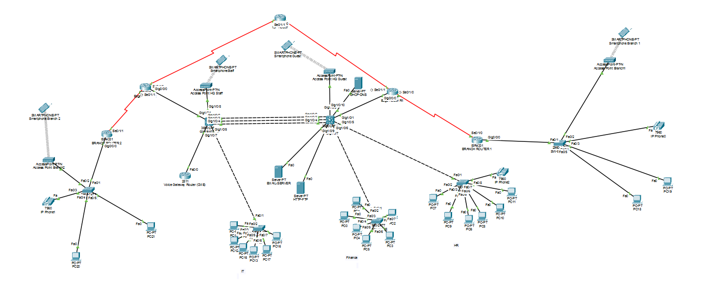

# SecureCorp Enterprise Network — NTI Graduation Project

A multi-site enterprise network designed and fully configured in Cisco Packet Tracer: dual redundant HQ core switches, dual edge routers, two branch sites over WAN, a dedicated voice gateway, wireless staff/guest networks, and a complete HQ server farm — built and verified end to end.

**Author:** Omar Mohamed
**LinkedIn:** [linkedin.com/in/omar-mohamed-b732653ab](http://www.linkedin.com/in/omar-mohamed-b732653ab)
**Institute:** National Telecommunication Institute (NTI)

---

## 📌 Project Deliverables

| # | Deliverable | Link |
|---|---|---|
| 1 | GitHub Repo | You're in it — `github.com/omar-mohamed2030/securecorp-nti-project` |
| 2 | Project (.pkt) | [🔗 Drive link] (https://drive.google.com/file/d/15bvEN1ynSRiDDLwlTvGFsliq7uN8LczG/view?usp=drive_link) |
| 3 | Presentation | [🔗 Drive link](https://docs.google.com/presentation/d/1TeyvWaHS5TMDvZ9N2i5a-6sQwoP9guZu/edit?usp=drive_link&ouid=109511084654776047776&rtpof=true&sd=true) |
| 4 | Documentation | [📄 View in this repo](https://drive.google.com/file/d/1ipuV8M9Io2zJMvHqteDr2NTJntiX-8gI/view?usp=drive_link) |
| 5 | Excel (addressing/VLAN sheet) | [🔗 Drive link](https://docs.google.com/spreadsheets/d/1_55k0mrrRetXXd9exy6CCEau9a49rBzL/edit?usp=drive_link&ouid=109511084654776047776&rtpof=true&sd=true) |
| 6 | Video Demo | [🔗 Drive/YouTube link](https://drive.google.com/file/d/1VnEuljzbcEdreu07GsU6rucIfxq4yu-a/view?usp=drive_link) |
| 7 | Website | [🔗 Link] (https://astonishing-tarsier-dc7b3d.netlify.app/)

---

## 🗺️ Network Topology



A single Headquarters site with dual core switches and dual edge routers, connected to two branch offices over serial WAN links and to a simulated ISP for internet access.

---

## ✅ Requirements Coverage

| # | Requirement | Status | Where it lives |
|---|---|---|---|
| 1 | Routed network | ✅ Done | Every VLAN routed at HQ core SVIs; branches use router-on-a-stick |
| 2 | Routing — Static + Dynamic OSPF | ✅ Done | OSPF multi-area (Area 0 backbone, Area 1 & 2 for branches) + static default routes redistributed from both edge routers |
| 3 | Security *(CCNA Sem 1 Ch16, Sem 2 Ch10–11, Sem 3 Ch4–5)* | ✅ Done | Port security on every access port, SSH + local AAA on all L3 devices, extended ACL isolating the Guest VLAN from internal subnets |
| 4 | VLAN | ✅ Done | 8 VLANs (HR, Finance, IT, Servers, Voice, Wi-Fi Staff, Wi-Fi Guest, Management) + native VLAN |
| 5 | Services — DHCP / DNS / HTTP / FTP / Email | ✅ Done | Centralized server farm at HQ, relayed via `ip helper-address` to every remote VLAN |
| 6 | EtherChannel | ✅ Done | LACP-bundled 3× GigabitEthernet between the two core switches |
| 7 | FHRP | ✅ Done | HSRP active/standby split across both core switches for every HQ VLAN |
| 8 | WLAN | ✅ Done | Separate Staff and Guest SSIDs, each mapped to its own VLAN with independent access policy |
| 9 | NAT | ✅ Done | PAT (overload) for general internet access + static port-forwarding for HTTP/FTP/Email servers |
| 10 | IP Phone | ✅ Done | Cisco CME (Call Manager Express) on a dedicated voice gateway; phones registered at HQ and both branches |

---

## 🧰 Tech Stack

- **Simulator:** Cisco Packet Tracer
- **Routing:** OSPF (multi-area), static routing, route redistribution
- **Switching:** VLANs, 802.1Q trunking, EtherChannel (LACP), HSRP
- **Security:** Port Security, extended ACLs, SSH, local AAA
- **Services:** DHCP, DNS, HTTP, FTP, SMTP/POP3 (Email)
- **Voice:** Cisco Unified Communications Manager Express (CME)
- **Wireless:** Autonomous APs, WPA2-PSK, staff/guest network segmentation

---

## 📂 Repository Structure

```
securecorp-nti-project/
├── README.md
└── docs/
    ├── SecureCorp-Documentation.md   # Full device-by-device configuration
    └── topology.png                  # Topology diagram
```

The `.pkt` file, presentation, Excel sheet, and video are hosted on Google Drive/YouTube (linked above) rather than committed to this repo, to keep it lightweight.

---

## 👤 Author

**Omar Mohamed**
NTI Graduation Project — 2026
🔗 [LinkedIn](http://www.linkedin.com/in/omar-mohamed-b732653ab)

---

## 📄 License

This project is submitted as an academic graduation project for the National Telecommunication Institute (NTI). Feel free to reference or learn from it — attribution appreciated.
